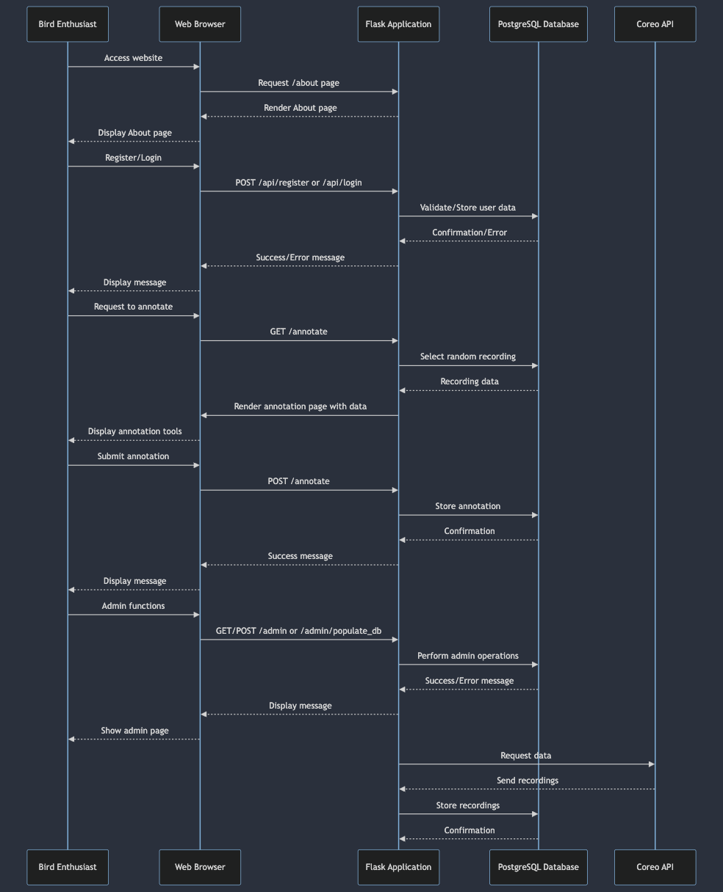

## About

Tag-a-Bird, an audio data annotation tool, was initiated by Munich's Biotopia Museum and
developed by students at CODE University of Applied Sciences. This tool serves a distinct
purpose: letting bird enthusiasts listen and visualize audio recordings to annotate specific species in them.
These recordings are sourced primarily from European users through the Dawn Chorus app and
they are supposed to feature intricate bird choirs. These choirs are composed of overlapping
calls and songs from various species, recorded in diverse lengths, environmental conditions,
and devices. The primary outcome of this project is to gather valuable data to augment the
capabilities of existing machine-learning models. Most of the avilable models are specialized in
recognizing isolated bird calls, and the fundamental objective of this annotation tool is to collect
data that could potentially assist in expanding the capability of these machine learning models
or training new ones, especially in terms of their performance under various environmental
conditions and recording scenarios.

## For SE_46 Web Backend Technologies_Reassesment

Since this is an assesment for the module book upgrade and I provided an ssl deployment with NGINX in last assesment and this application is not being actively used anymore, I did not take the time to issue new certificates this time. I hope that is ok. A live version of the application is hosted on a DigitalOcan virtualmachine, it is deployed with a self hosted github runner utilizing /.github/can-backend-24-yml, and can be visitde at:

http://209.38.201.24:8000/about

I mainly used the feedback from last assesment which I passed with level 0 as guidance while working on this version. Here is a list of changes:

- migrations with alembic now working
- routes modularized with blueprints and functions for GET and POST methods seperated
- application and database and tests have been dockerized
- better error handing
- logging with sentry

## Interaction Flow



## Running the app

0. prerequisites

docker and docker-compose

1. clone the repository

```
git clone https://github.com/tag-a-bird/backend.git
```

2. set required env vars listed in example.env then run

```
docker-compose up --build
```

## Endpoints

`GET /about` unprotected route that explains a bit more about the project

`GET /api/register` renders registration form

`POST /api/register` registers a new user (saves into our database)

`GET /api/login` renders the login form

`POST /api/login` with the help of the loginManager, logs registered users in. The endpoint is rate limited (max 5 failed attempts/hour)

`GET /api/logout` logs current user out, clears the session

`GET /admin` only a logged in admin can access it, renders the parameter setting form

`POST /admin` saves parameters to the query_config table

`GET /admin/populate_db` only logged in admins can access it, renders the form to populate the database

`POST /admin/populate_db` populates the database with recordings by sending a request to the Coreo Api with the parameters from query_config

`GET /annotate` randomly selects a recording from the database and renders its id, segments, waveform and spectrogram. Also renders the annotation toolbar.

`POST /annotate` saves selected labels to the database

## Threat model


