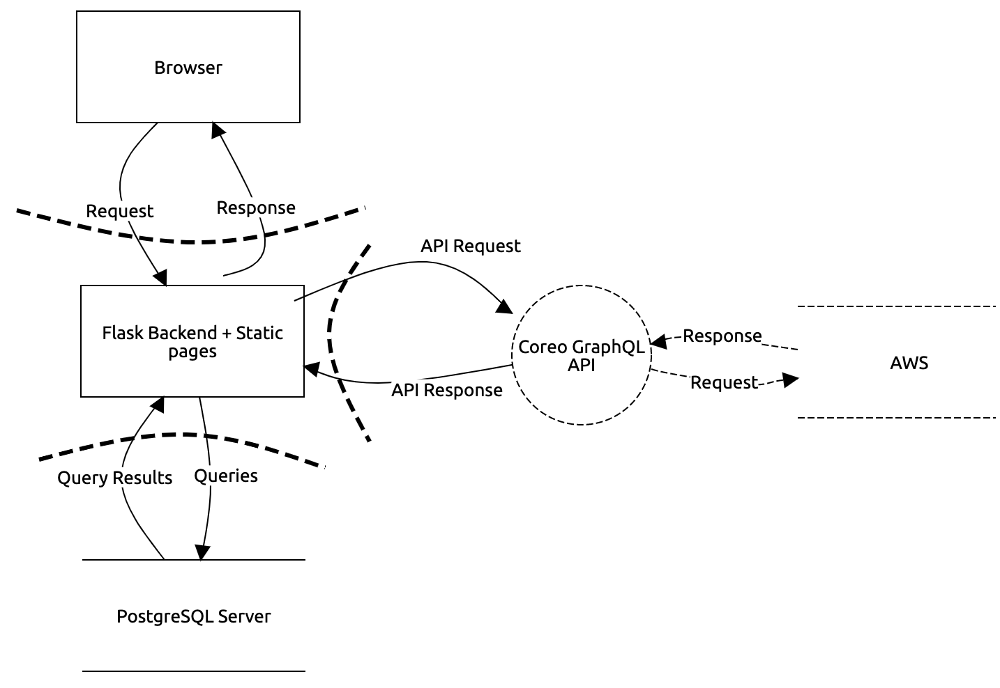

## About
Tag a bird is an audio data annotation tool, focusing on bioacoustics. Audio data can be a valuable resource for monitoring ecosystems, and while there are increasing amounts of recordings collected every day, the data is mostly unlabelled. In order to turn these recordings into usable input for any algorithm that analyzes and learns from them, we need to label them. We need to know which animals are audible in which parts of the recordings. Our tool allows experts and bird enthusiasts to listen to recordings collected and made by the [Dawn Chorus project](https://dawn-chorus.org/en/) and segment by segment, specify birds they recognise. 

## Backend Architecture


## Running the app
0. prerequisites

you have [poetry](https://python-poetry.org/docs/#installation), [postgresql](https://www.postgresql.org/download/) and python3.10 installed 

1. create local postgres databases
```
createdb local_db
createdb local_test_db

```
2. clone the repository
```
git clone https://github.com/tag-a-bird/backend.git
cd backend
```
3. activate the virtual environment and install dependencies
```
poetry shell
poetry install
```
4. create an .env file according to example.env
```
cd tag_a_bird_backend
echo "FLASK_APP=app.py
FLASK_DATABASE_URI=postgresql://localhost/local_db
FLASK_TEST_DATABASE_URI=postgresql://localhost/local_test_db
FLASK_SECRET_KEY=<a_secret_key>
COREO_API_KEY=<api_key>
ADMIN_CREDENTIALS_PW=<admin_pw>
ADMIN_CREDENTIALS_EMAIL=<admin_email>" > .env
```
5. start local dev server on http://localhost:5000/about
```
flask run
```

## Endpoints
`GET /about` unprotected route that explains a bit more about the project

`GET /api/register` renders registration form

`POST /api/register` registers a new user (saves into our database)

`GET /api/login` renders the login form

`POST /api/login` with the help of the loginManager, logs registered users in. The endpoint is rate limited (max 5 failed attempts/hour)

`GET /api/logout` logs current user out, clears the session

`GET /admin` only a logged in admin can access it, renders the parameter setting form 

`POST /admin` saves parameters to the query_config table

`GET /admin/populate_db` only logged in admins can access it, renders the form to populate the database

`POST /admin/populate_db` populates the database with recordings by sending a request to the Coreo Api with the parameters from query_config

`GET /annotate` randomly selects a recording from the database and renders its id, segments, waveform and spectrogram. Also renders the annotation toolbar.

`POST /annotate` saves selected labels to the database

## Testing
for running tests, type 
```
pytest -v
```
## Cyber Security
Disclaimer: the implementation of certain cyber security measures is currently ongoing. The reason for that is the necessity of stable deployment so our clients are able to test and use the tool uninterrupted. In the near future, with the implementation of a proper CI/CD pipeline, added security measures will be live more quickly. 

### Threat model 


### Security measures
Implemented Security Headers with [secure.py](https://secure.readthedocs.io/en/latest/)
 
Prevent SQL Injection
  * Parameterizing sensitive query inputs (SQLAlchemy)

  
Secure Authentication
  * Requiring long passwords (min. 8 characters) 
  * Rate limiting failed login attempts (5 per hour)
  * Using JWT tokens (currently only on a separate development branch) 
  * Email validation (py3-validate-email)
  

Protect Sensitive Data
  * Password hashing and salting (currently using flask-scrypt)
  *	Encrypted database in production
  * Encrypt data transmission with secure TLS protocol
  

Secure Configurations
  * Keep error messages vague
